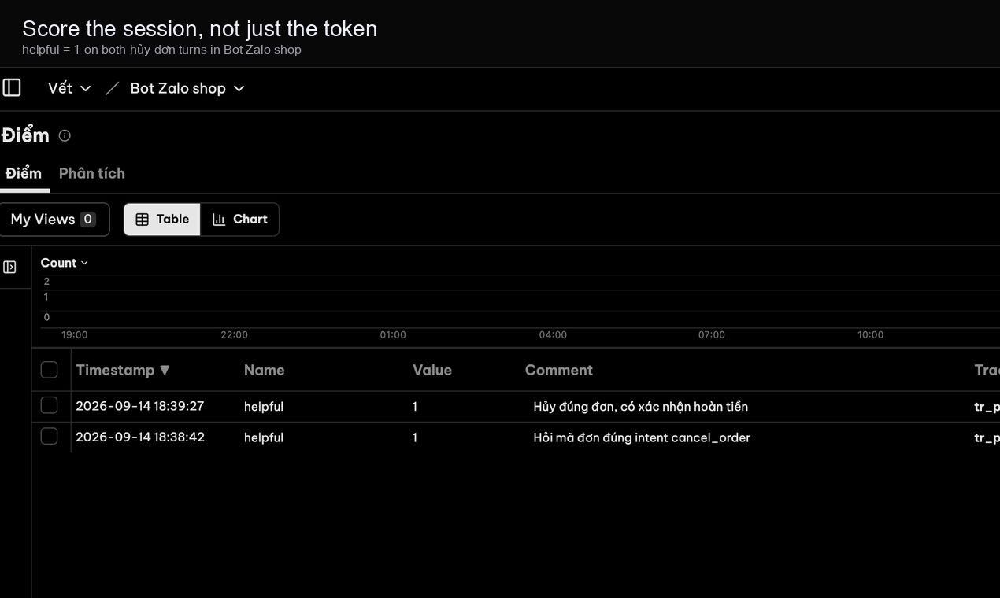

# Vết


[Tiếng Việt](README.md) · **English**

LLM observability plus Vietnamese production channels (Zalo, FPT.AI, Viettel, Lark). Self-hosted. Console is Langfuse OSS v4.33.0.

<p align="center">
  
</p>

<table>
  <tr>
    <td width="50%"></td>
    <td width="50%"></td>
  </tr>
  <tr>
    <td width="50%"></td>
    <td width="50%"></td>
  </tr>
</table>

<p align="center">
  
</p>

## Run locally

```bash
git clone --recurse-submodules https://github.com/Dondo0936/langben.git
cd langben
cp .env.console.example .env
bash scripts/up.sh
```

| | URL |
|---|---|
| Console | [http://localhost:3000](http://localhost:3000) |
| Kênh, Lộ trình, `/hooks` | [http://localhost:43173](http://localhost:43173) |

Login: `demo@vet.dev` / `demodemo`. Org Vết, project Bot Zalo shop (`prj-vet-demo`).

First run takes several minutes. If `docker` needs root, the script uses `sudo`. Rotate the demo password and keys before exposing any port.

Docs: [docs/README.en.md](docs/README.en.md).

## Repo layout

```
apps/web                 Kênh / Lộ trình / webhooks
vendor/langfuse          Langfuse OSS submodule (console :3000)
overlay/langfuse         Vietnamese UI overlay on the console
docs                     Console documentation
readme                   GitHub README screenshots
```

See [NOTICE](NOTICE).
