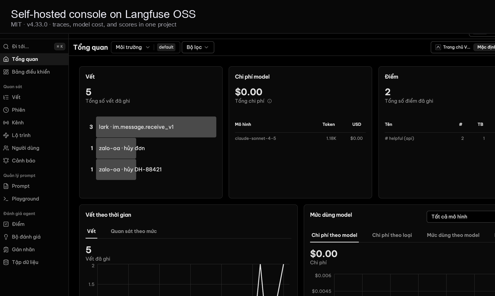
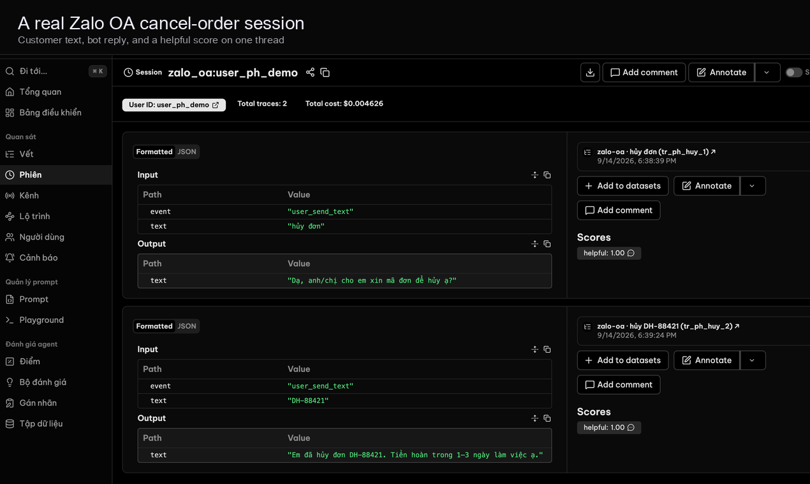
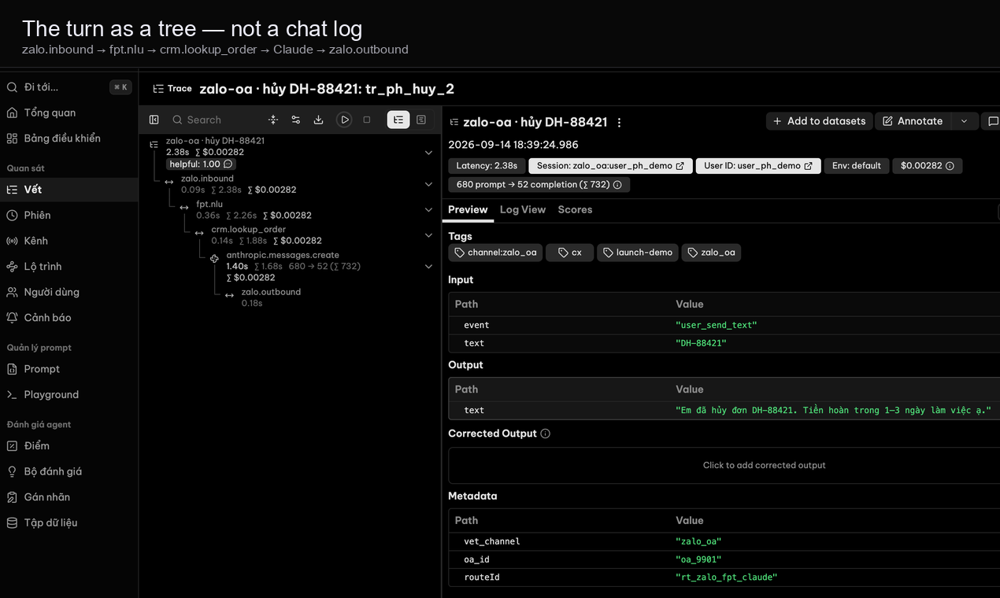
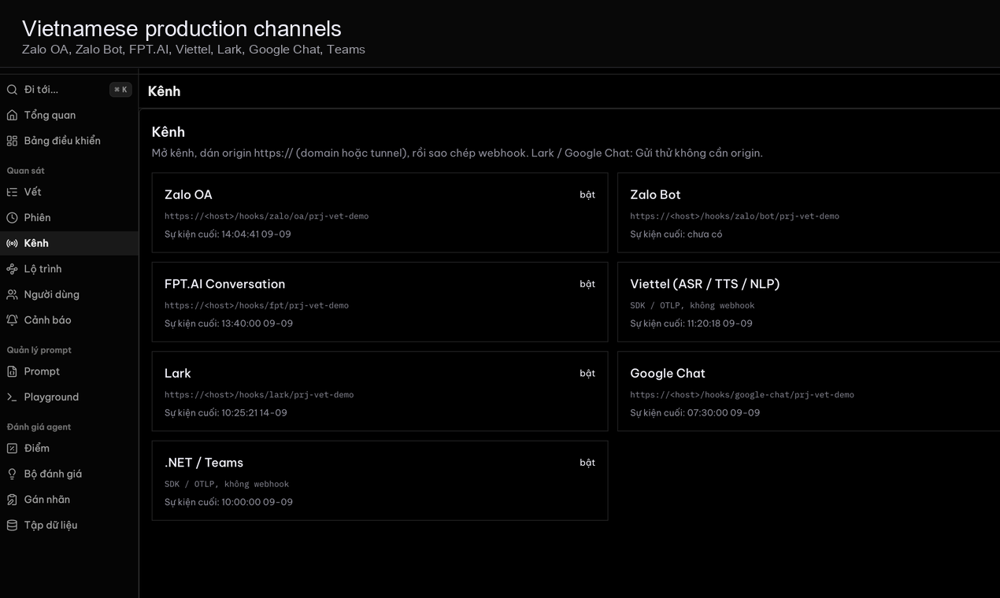
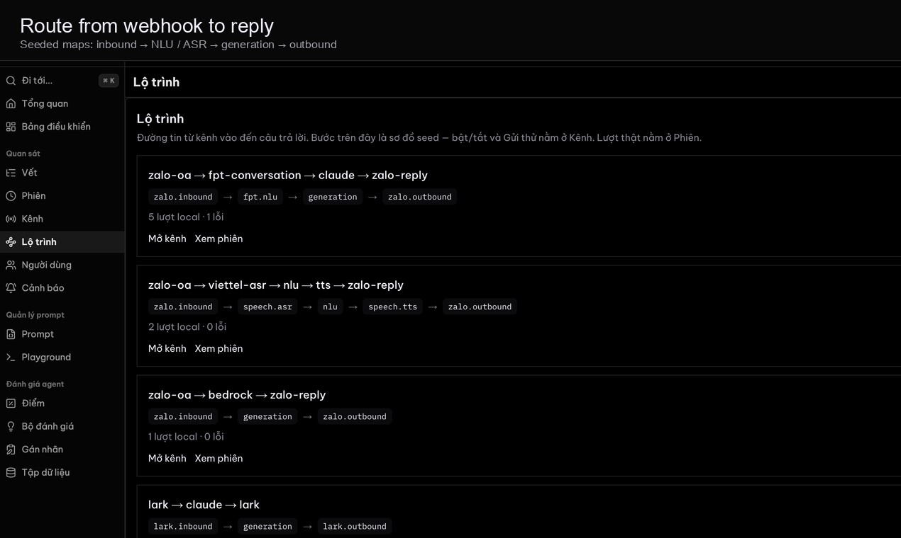

# Vết


[Tiếng Việt](README.md) · **English**

Langfuse-class LLM observability **plus** Vietnamese production channels (Zalo, FPT.AI, Viettel, Lark, Google Chat, .NET). Built-in generation layers for Amazon Bedrock, Google Cloud Vertex AI, and Microsoft Foundry.

**Working name.** Vietnamese for “trace / mark.” MIT licensed.

Public clone: [github.com/Dondo0936/langben](https://github.com/Dondo0936/langben). Issues: [github.com/Dondo0936/langben/issues](https://github.com/Dondo0936/langben/issues).

The **console** is Langfuse OSS (MIT, ClickHouse, Inc.) rebranded as Vết. Kênh / Lộ trình and Zalo–FPT hooks are original. The public landing is a separate Vercel site. We do not ship `ee/` or `LANGFUSE_EE_LICENSE_KEY`. See [NOTICE](NOTICE).

Pinned runtime: **Langfuse v4.33.0** (`81bbfd169b72ea2ed53639699cc6632e8f908ce8`) in `vendor/langfuse`.

<p align="center">
  
</p>

<table>
  <tr>
    <td width="50%"></td>
    <td width="50%"></td>
  </tr>
  <tr>
    <td width="50%"></td>
    <td width="50%"></td>
  </tr>
</table>

<p align="center">
  
</p>

Screenshots are a local **Bot Zalo shop** run after `bash scripts/up.sh`: customer says hủy đơn, the bot looks up DH-88421, and the same turn is a session, a tree, and a score.

---

## How we package it

Vết is **open source self-host** (MIT). You run it. Units are unlimited. Start with `bash scripts/up.sh`.

Docker starts the **platform**: console on `:3000`, plus Kênh / Lộ trình and webhooks on `:43173`. It does not start the public landing, docs, or pricing pages. Those stay on the Vercel site.

A **đơn vị / unit** is not an LLM token. One unit = one trace, observation, or score. Self-host does not meter them. Explainer: `/docs/units`. Pricing: `/pricing`.

---

## Run locally

```bash
git clone --recurse-submodules https://github.com/Dondo0936/langben.git
cd langben
cp .env.console.example .env
bash scripts/up.sh
```

Already cloned: `git submodule update --init --recursive` (or `bash scripts/bootstrap-langfuse.sh`), then the same `.env` and `up.sh` steps.

`scripts/up.sh` applies the Vết overlay, builds `vet-console:local`, and starts the platform web + Langfuse. The first build compiles the console overlay and takes several minutes. Later runs are faster if the images still exist. Equivalent after overlay: `bash scripts/compose.sh up --build`. Do not rely on `COMPOSE_FILE` in `.env`; the script passes `-f` flags and unsets `COMPOSE_FILE`. If `docker` needs root, the script uses `sudo`.

| Surface | URL |
|---|---|
| Platform web (Kênh, Lộ trình, `/hooks`) | [http://localhost:43173](http://localhost:43173) |
| Console (Vết overlay on Langfuse OSS) | [http://localhost:3000](http://localhost:3000) |

Console login: `demo@vet.dev` / `demodemo` (≥ 8 characters). Org **Vết**, project **Bot Zalo shop** (`prj-vet-demo`).

Ingest keys (Langfuse public API): `pk-lf-vet-demo` / `sk-lf-vet-demo`.

Webhook URLs on Kênh start empty. **Gửi thử** and the fixture scripts post to loopback `:43173` — enough to see a local session, no public HTTPS required. A **live** Zalo / Lark / Chat message needs an `https://` origin (your domain or a tunnel) pasted on Kênh → Origin công khai. An `https` `VET_PUBLIC_URL` in `.env` is only a default until someone saves a different host on Kênh. Do not export `VET_PUBLIC_URL` in the shell — `compose.sh` drops a leftover shell value so `.env` wins.

Seed the Zalo «hủy đơn» tree into the console (filters / waterfall):

```bash
node scripts/seed-langfuse-zalo.mjs
```

### Zalo OA fixture (signature verify → Langfuse traces)

```bash
# Uses VET_PUBLIC_URL if set, else http://localhost:43173
unset VET_PUBLIC_URL
node scripts/zalo-fixture.mjs
```

Invalid MAC → **401** and no turn. Valid MAC → session `zalo_oa:user_fixture` on **Sessions** in the console.

### Zalo Bot (bot.zapps.me, no OA package)

This is not the Chatbot tab inside OA admin (that tab is paid). Create a bot at [bot.zapps.me](https://bot.zapps.me).

1. On Kênh → Zalo Bot, paste **Secret Token** (not Bot Token) and Lưu.
2. Paste a public `https://` origin on Kênh → Origin công khai. Zalo cannot POST to `localhost`.
3. Copy the full URL `https://<host>/hooks/zalo/bot/prj-vet-demo` into Webhook URL. Zalo rejects a path without `https://`.
4. Lưu thay đổi on bot.zapps.me, then message the bot. Session `zalo_bot:<user id>` appears in the console.

```bash
unset VET_PUBLIC_URL
node scripts/zalo-bot-fixture.mjs
```

### Lark / Google Chat fixtures (no developer app)

You do not need a Lark or Google Chat app to test those webhooks locally. Demo tokens are already on Kênh.

```bash
unset VET_PUBLIC_URL
node scripts/lark-fixture.mjs    # url_verification + inbound → session lark:ou_fixture
node scripts/gchat-fixture.mjs   # Bearer token + inbound → session gchat:users_fixture
```

Invalid token → **401**. In the console, Kênh → Lark or Google Chat → **Gửi thử** does the same ingest into sessions `lark:ou_local` / `gchat:users_local`.

A real Lark/Google bot still needs their developer console and a public HTTPS URL. Do that when you have the app; the local fixtures cover ingest + overlay first.

Public site only (landing / docs / pricing, no console). This is not the Docker product:

```bash
npm install
npm run dev   # :43173 with the brochure
```

---

## Repo layout

```
apps/web                 Public site (Vercel) + platform routes. Docker strips the brochure.
vendor/langfuse          Langfuse OSS submodule (console :3000)
overlay/langfuse         Vết logo, nav, hội thoại — applied at image build
packages/schema          Zod: turns, spans, channel enums
packages/sdk-js          observe, wrapAnthropic, wrapFptGetAnswer → Langfuse ingest
docs/plans               Product plan (HTML)
LICENSE · NOTICE
```

---

## SDKs

`@vet/sdk` is `packages/sdk-js` in this repo. It is not published to npm yet. After clone, import the workspace package.

```ts
import Anthropic from "@anthropic-ai/sdk"
import { wrapAnthropic, observe } from "@vet/sdk"

const client = wrapAnthropic(new Anthropic(), {
  publicKey: "pk-lf-vet-demo",
  secretKey: "sk-lf-vet-demo",
  baseUrl: "http://localhost:3000",
})

await observe("hỗ-trợ-khách", () =>
  client.messages.create({ model, max_tokens, messages }),
{ publicKey, secretKey, baseUrl, sessionId, userId, tags: ["zalo"] })
```

Never send `ANTHROPIC_API_KEY` (or AWS/GCP/Azure secrets) to Vết. Send traces only.

OTLP: Langfuse public OTLP on the console. Homemade `POST /otlp/v1/traces` on :43173 still dual-writes when `LANGFUSE_*` keys are set.

---

## Parked (not this build)

| Idea | Doc |
|------|-----|
| Excel pipeline-point eval kit | [docs/ideas/01-excel-pipeline-eval.md](docs/ideas/01-excel-pipeline-eval.md) |
| Standalone usage-report SaaS | [docs/ideas/02-agent-trace-usage-saas.md](docs/ideas/02-agent-trace-usage-saas.md) (absorbed as turn receipts) |

Implementation source of truth: [docs/plans/vet-full-plan.html](docs/plans/vet-full-plan.html).
