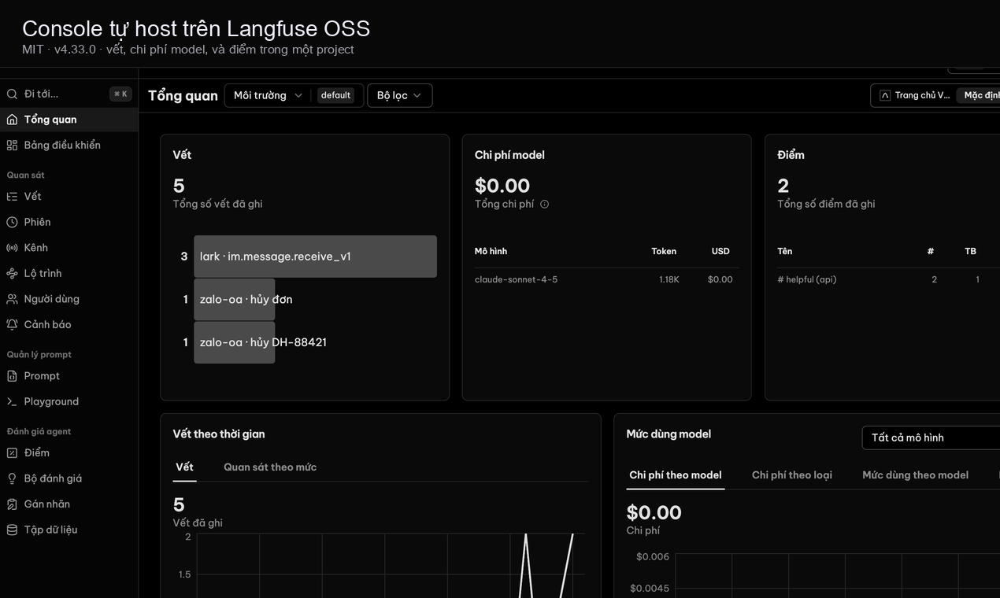
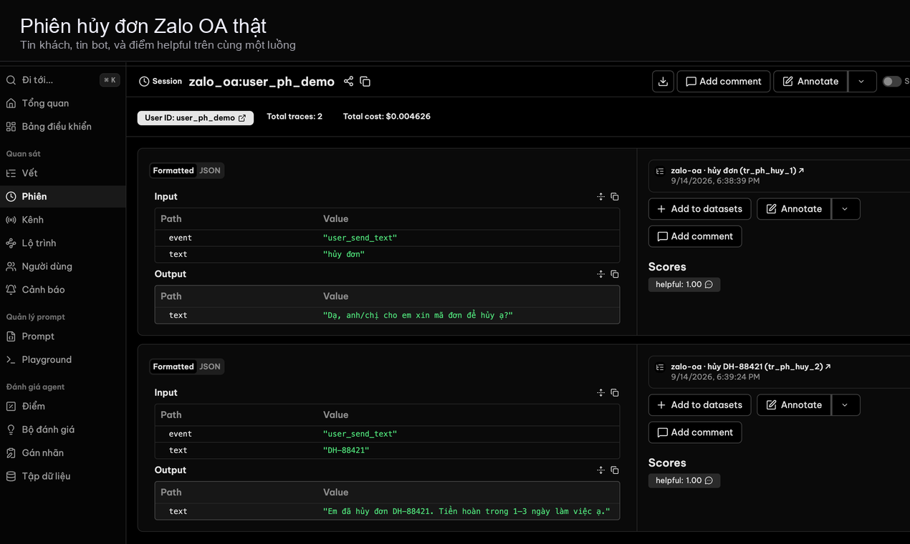
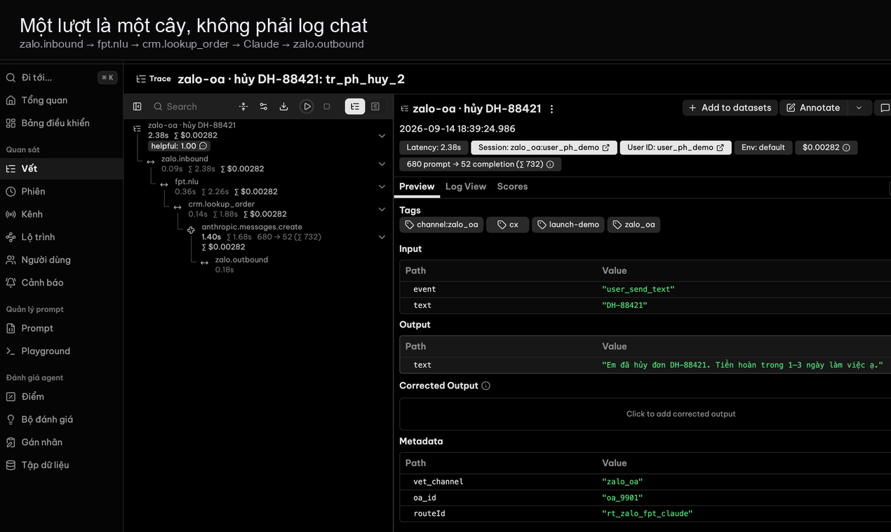
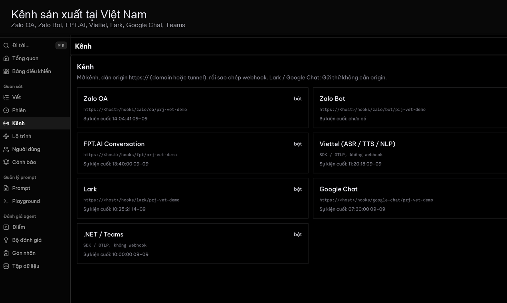

# Vết


**Tiếng Việt** · [English](README.en.md)

LLM observability plus Vietnamese production channels (Zalo, FPT.AI, Viettel, Lark). Self-hosted. Console is Langfuse OSS v4.33.0.

<p align="center">
  
</p>

<table>
  <tr>
    <td width="50%"></td>
    <td width="50%"></td>
  </tr>
  <tr>
    <td width="50%"></td>
    <td width="50%"></td>
  </tr>
</table>

<p align="center">
  
</p>

## Chạy local

```bash
git clone --recurse-submodules https://github.com/Dondo0936/langben.git
cd langben
cp .env.console.example .env
bash scripts/up.sh
```

| | URL |
|---|---|
| Console | [http://localhost:3000](http://localhost:3000) |
| Kênh, Lộ trình, `/hooks` | [http://localhost:43173](http://localhost:43173) |

Đăng nhập: `demo@vet.dev` / `demodemo`. Org Vết, project Bot Zalo shop (`prj-vet-demo`).

Lần đầu mất vài phút. `docker` cần root thì script dùng `sudo`. Đổi mật khẩu và khóa demo trước khi mở cổng ra ngoài.

Tài liệu: [docs/README.md](docs/README.md).

## Cấu trúc repo

```
apps/web                 Kênh / Lộ trình / webhook
vendor/langfuse          Submodule Langfuse OSS (console :3000)
overlay/langfuse         UI tiếng Việt trên console
docs                     Tài liệu console
readme                   Ảnh GitHub README
```

Xem [NOTICE](NOTICE).
