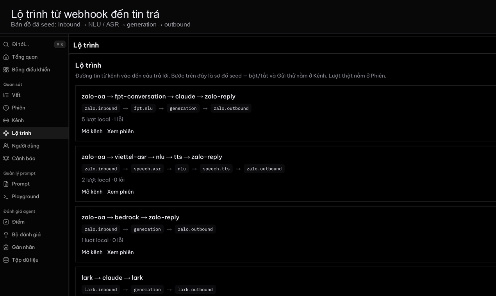
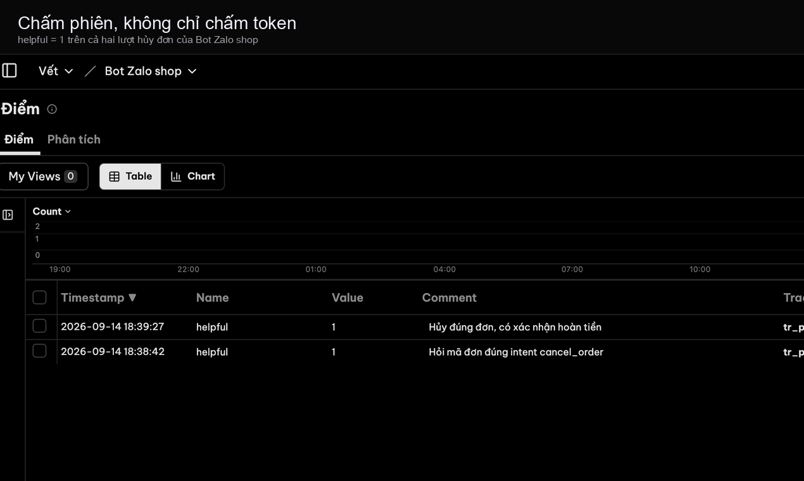

# Vết


**Tiếng Việt** · [English](README.en.md)

Quan sát LLM kiểu Langfuse **kèm** kênh production Việt Nam (Zalo, FPT.AI, Viettel, Lark, Google Chat, .NET). Có lớp generation cho Amazon Bedrock, Google Cloud Vertex AI, và Microsoft Foundry.

**Tên đang dùng.** Vết = dấu vết / mark. Giấy phép MIT.

Clone công khai: [github.com/Dondo0936/langben](https://github.com/Dondo0936/langben). Issues: [github.com/Dondo0936/langben/issues](https://github.com/Dondo0936/langben/issues).

**Console** là Langfuse OSS (MIT, ClickHouse, Inc.) gắn thương hiệu Vết. Kênh / Lộ trình và hook Zalo–FPT là phần gốc. Landing public là site Vercel riêng. Không ship `ee/` hay `LANGFUSE_EE_LICENSE_KEY`. Xem [NOTICE](NOTICE).

Runtime ghim: **Langfuse v4.33.0** (`81bbfd169b72ea2ed53639699cc6632e8f908ce8`) trong `vendor/langfuse`.

<p align="center">
  
</p>

<table>
  <tr>
    <td width="50%"></td>
    <td width="50%"></td>
  </tr>
  <tr>
    <td width="50%"></td>
    <td width="50%"></td>
  </tr>
</table>

<p align="center">
  
</p>

Ảnh từ project local **Bot Zalo shop** sau `bash scripts/up.sh`: khách nói hủy đơn, bot tra DH-88421; cùng một lượt hiện thành phiên, cây vết, và điểm.

---

## Cách đóng gói

Vết là **open source tự host** (MIT). Bạn chạy trên máy mình. Đơn vị không giới hạn. Bắt đầu bằng `bash scripts/up.sh`.

Docker mở **nền tảng**: console `:3000`, cộng Kênh / Lộ trình và webhook `:43173`. Không mở landing, docs, hay trang giá. Những trang đó nằm trên site Vercel.

Một **đơn vị** không phải token LLM. Một đơn vị = một vết, observation, hoặc điểm. Tự host không đếm. Giải thích: `/docs/units`. Giá: `/pricing`.

---

## Chạy local

```bash
git clone --recurse-submodules https://github.com/Dondo0936/langben.git
cd langben
cp .env.console.example .env
bash scripts/up.sh
```

Đã clone: `git submodule update --init --recursive` (hoặc `bash scripts/bootstrap-langfuse.sh`), rồi cùng bước `.env` và `up.sh`.

`scripts/up.sh` gắn overlay Vết, build `vet-console:local`, rồi chạy web nền tảng + Langfuse. Lần đầu compile overlay, mất vài phút. Lần sau nhanh hơn nếu image còn. Tương đương sau overlay: `bash scripts/compose.sh up --build`. Đừng dựa vào `COMPOSE_FILE` trong `.env`; script tự truyền `-f` và gỡ `COMPOSE_FILE`. Nếu `docker` cần root, script dùng `sudo`.

| Mặt | URL |
|---|---|
| Web nền tảng (Kênh, Lộ trình, `/hooks`) | [http://localhost:43173](http://localhost:43173) |
| Console (overlay Vết trên Langfuse OSS) | [http://localhost:3000](http://localhost:3000) |

Đăng nhập console: `demo@vet.dev` / `demodemo` (≥ 8 ký tự). Org **Vết**, project **Bot Zalo shop** (`prj-vet-demo`).

Khóa ingest (Langfuse public API): `pk-lf-vet-demo` / `sk-lf-vet-demo`.

URL webhook trên Kênh lúc đầu trống. **Gửi thử** và các script fixture gọi loopback `:43173` — đủ để xem phiên local, không cần HTTPS công khai. Tin Zalo / Lark / Chat **thật** mới cần origin `https://` (domain hoặc tunnel) dán vào Kênh → Origin công khai. `VET_PUBLIC_URL` `https` trong `.env` chỉ là mặc định cho đến khi ai đó lưu origin khác trên Kênh. Đừng `export VET_PUBLIC_URL` trong shell; `compose.sh` bỏ giá trị shell để `.env` thắng.

Seed cây Zalo «hủy đơn» vào console (filter / waterfall):

```bash
node scripts/seed-langfuse-zalo.mjs
```

### Fixture Zalo OA (đối chiếu chữ ký → vết Langfuse)

```bash
# Dùng VET_PUBLIC_URL nếu có, không thì http://localhost:43173
unset VET_PUBLIC_URL
node scripts/zalo-fixture.mjs
```

MAC sai → **401**, không có lượt. MAC đúng → phiên `zalo_oa:user_fixture` trên **Phiên** trong console.

### Zalo Bot (bot.zapps.me, không gói OA)

Đây không phải tab Chatbot trong OA admin (tab đó trả phí). Tạo bot tại [bot.zapps.me](https://bot.zapps.me).

1. Kênh → Zalo Bot, dán **Secret Token** (không phải Bot Token) rồi Lưu.
2. Dán origin `https://` công khai trên Kênh → Origin công khai. Zalo không POST được `localhost`.
3. Copy URL đầy đủ `https://<host>/hooks/zalo/bot/prj-vet-demo` vào Webhook URL. Zalo từ chối path thiếu `https://`.
4. Lưu thay đổi trên bot.zapps.me, rồi nhắn bot. Phiên `zalo_bot:<user id>` hiện trên console.

```bash
unset VET_PUBLIC_URL
node scripts/zalo-bot-fixture.mjs
```

### Fixture Lark / Google Chat (không cần app)

Không cần app Lark hay Google Chat để thử webhook local. Token demo đã có trên Kênh.

```bash
unset VET_PUBLIC_URL
node scripts/lark-fixture.mjs    # url_verification + inbound → phiên lark:ou_fixture
node scripts/gchat-fixture.mjs   # Bearer token + inbound → phiên gchat:users_fixture
```

Token sai → **401**. Trong console, Kênh → Lark hoặc Google Chat → **Gửi thử** ingest vào phiên `lark:ou_local` / `gchat:users_local`.

Bot Lark/Google thật vẫn cần developer console của họ và URL `https` công khai. Làm bước đó khi đã có app; fixture local lo ingest + overlay trước.

Chỉ site public (landing / docs / giá, không console). Đây không phải sản phẩm Docker:

```bash
npm install
npm run dev   # :43173 với brochure
```

---

## Cấu trúc repo

```
apps/web                 Site public (Vercel) + route nền tảng. Docker gỡ brochure.
vendor/langfuse          Submodule Langfuse OSS (console :3000)
overlay/langfuse         Logo Vết, nav, hội thoại — gắn lúc build image
packages/schema          Zod: lượt, span, enum kênh
packages/sdk-js          observe, wrapAnthropic, wrapFptGetAnswer → ingest Langfuse
docs/plans               Kế hoạch sản phẩm (HTML)
LICENSE · NOTICE
```

---

## SDK

`@vet/sdk` là `packages/sdk-js` trong repo này. Chưa publish lên npm. Sau khi clone, import package workspace.

```ts
import Anthropic from "@anthropic-ai/sdk"
import { wrapAnthropic, observe } from "@vet/sdk"

const client = wrapAnthropic(new Anthropic(), {
  publicKey: "pk-lf-vet-demo",
  secretKey: "sk-lf-vet-demo",
  baseUrl: "http://localhost:3000",
})

await observe("hỗ-trợ-khách", () =>
  client.messages.create({ model, max_tokens, messages }),
{ publicKey, secretKey, baseUrl, sessionId, userId, tags: ["zalo"] })
```

Đừng gửi `ANTHROPIC_API_KEY` (hay secret AWS/GCP/Azure) cho Vết. Chỉ gửi traces.

OTLP: OTLP public của Langfuse trên console. `POST /otlp/v1/traces` tự viết trên :43173 vẫn dual-write khi đã set khóa `LANGFUSE_*`.

---

## Tạm để (không nằm build này)

| Ý tưởng | Tài liệu |
|------|-----|
| Bộ eval điểm pipeline trên Excel | [docs/ideas/01-excel-pipeline-eval.md](docs/ideas/01-excel-pipeline-eval.md) |
| SaaS báo cáo usage tách riêng | [docs/ideas/02-agent-trace-usage-saas.md](docs/ideas/02-agent-trace-usage-saas.md) (gộp thành biên lai lượt) |

Nguồn sự thật khi implement: [docs/plans/vet-full-plan.html](docs/plans/vet-full-plan.html).
